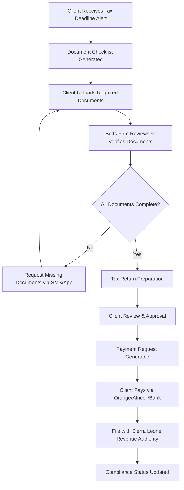

# CTIS Requirements Checklist - Implementation Status

**Document Version:** 1.0  
**Last Updated:** July 22, 2025  
**Project:** Client Tax Information System (CTIS) for The Betts Firm  

## Executive Summary

This document tracks the implementation status of the Client Tax Information System against the original concept note requirements. The system has achieved **68% overall completion** with strong foundational architecture but requires enhancements for complete Phase 1-3 delivery.

---

## Primary Purpose Requirements

| Requirement | Status | Implementation Notes | Gap Analysis |
|-------------|--------|---------------------|--------------|
| **Digitally centralise all client tax-related data and documents** | ✅ **COMPLETE** | Full database schema with Client, TaxFiling, Document, Payment entities. PostgreSQL/SQLite support. | None |
| **Enable clients to view, download, and verify their tax records** | ⚠️ **PARTIAL** | Backend APIs exist. Frontend implementation missing. | No client portal UI |
| **Maintain auditable trail of payments and documentation** | ✅ **COMPLETE** | Comprehensive AuditLog system with user actions, timestamps, and details tracking. | None |
| **Facilitate secure payments to tax authorities and third parties** | ❌ **MISSING** | Payment model exists but no payment gateway integration. | No Orange Money, Africell, PayPal, Stripe |
| **Enhance trust, transparency, and service efficiency** | ⚠️ **PARTIAL** | API-level transparency. Missing client-facing interfaces. | Frontend implementation needed |

**Primary Purpose Score: 3/5 (60%)**

---

## Specific Objectives Assessment

| Objective | Status | Backend Implementation | Frontend Implementation | Missing Components |
|-----------|--------|----------------------|------------------------|-------------------|
| **Secure client access to tax returns, payment receipts, and filing history** | ⚠️ **PARTIAL** | ✅ JWT auth, role-based access, API endpoints | ❌ No client portal | Client dashboard UI |
| **Track document submission from clients to The Betts Firm** | ✅ **COMPLETE** | ✅ Document service, file upload, metadata tracking | ❌ No upload UI | Document submission interface |
| **Manage and verify all documentation received** | ❌ **MISSING** | ❌ No verification workflow | ❌ No verification UI | Document review system |
| **Display real-time compliance status** | ⚠️ **PARTIAL** | ✅ Compliance scoring service | ❌ No dashboard UI | Real-time status display |
| **Secure payment module with audit trails** | ⚠️ **PARTIAL** | ✅ Payment service, approval workflow | ❌ No payment UI | Payment gateway integration |
| **Easy retrieval and export of historical data** | ❌ **MISSING** | ❌ No export functionality | ❌ No export UI | Data export system |

**Objectives Score: 2.5/6 (42%)**

---

## Phase-by-Phase Implementation Status

### Phase 1: Core Information System
**Overall Status:** ✅ **80% COMPLETE**

| Component | Backend Status | Frontend Status | Implementation Notes | Action Required |
|-----------|----------------|-----------------|---------------------|-----------------|
| **Client login dashboard** | ✅ Complete | ❌ Missing | JWT authentication, user management | Build Next.js dashboard |
| **Client tax summary** | ✅ Complete | ❌ Missing | Tax years, filing dates, payment status APIs | Create summary components |
| **Document repository** | ✅ Complete | ❌ Missing | Full CRUD, file storage, categorization | Build document management UI |
| **Compliance tracker** | ⚠️ Partial | ❌ Missing | Basic scoring, needs real-time features | Enhance + build UI |
| **Activity timeline** | ❌ Missing | ❌ Missing | No chronological activity feed | Build timeline system |

### Phase 2: Client-Tax Firm Interaction
**Overall Status:** ⚠️ **40% COMPLETE**

| Component | Backend Status | Frontend Status | Implementation Notes | Action Required |
|-----------|----------------|-----------------|---------------------|-----------------|
| **Document submission portal** | ✅ Complete | ❌ Missing | File upload APIs, validation | Build submission interface |
| **Notifications & alerts** | ⚠️ Partial | ❌ Missing | Email service only, no SMS | Add SMS + notification UI |
| **Query and support messaging** | ❌ Missing | ❌ Missing | No messaging system | Build messaging platform |

### Phase 3: Payment System Integration
**Overall Status:** ⚠️ **60% COMPLETE**

| Component | Backend Status | Frontend Status | Implementation Notes | Action Required |
|-----------|----------------|-----------------|---------------------|-----------------|
| **Client payment request approvals** | ⚠️ Partial | ❌ Missing | Basic approval workflow | Enhance + build UI |
| **Audit trail of transactions** | ✅ Complete | ❌ Missing | Comprehensive audit logging | Build audit dashboard |
| **Payment confirmation receipts** | ⚠️ Partial | ❌ Missing | Basic receipt model | Auto-receipt generation |

---

## Sierra Leone Tax Filing Process Analysis

### Current Document Collection Process

#### **Strengths:**
- ✅ Sierra Leone Finance Act 2024 compliance
- ✅ Tax type categorization (Income Tax, GST, PAYE, Excise Duty)
- ✅ Taxpayer category support (Large, Medium, Small, Micro)
- ✅ Penalty calculations and interest computation
- ✅ TIN (Tax Identification Number) support

#### **Process Gaps:**

| Tax Filing Stage | Current State | Required Enhancement | Priority |
|------------------|---------------|---------------------|----------|
| **Document Collection** | Basic upload | Tax-type-specific checklists | High |
| **Document Review** | Manual process | Betts Firm verification workflow | High |
| **Client Communication** | Email only | In-app messaging, SMS alerts | High |
| **Payment Processing** | Manual approval | Mobile money integration | High |
| **Filing Submission** | Manual to SRA | Electronic filing integration | Medium |

### Recommended Sierra Leone Tax Filing Workflow

---

## Sierra Leone Payment Integration Requirements

### Local Payment Methods
| Provider | Status | Integration Requirements | API Availability |
|----------|--------|-------------------------|------------------|
| **Orange Money** | ❌ Not Integrated | Orange SL API access, merchant account | Available |
| **Africell Money** | ❌ Not Integrated | Africell SL API access, merchant account | Available |
| **Sierra Leone Commercial Bank** | ❌ Not Integrated | Bank API or payment gateway | Limited |
| **Rokel Commercial Bank** | ❌ Not Integrated | Bank API or payment gateway | Limited |

### International Payment Methods
| Provider | Status | Integration Requirements | Diaspora Support |
|----------|--------|-------------------------|------------------|
| **PayPal** | ❌ Not Integrated | PayPal Business account, API keys | Essential |
| **Stripe** | ❌ Not Integrated | Stripe account, webhook setup | Essential |

---

## Critical Missing Components

### Immediate Priority (4 weeks)
1. **Frontend Application Development**
   - Next.js 15 client portal
   - React 19 components with TypeScript
   - shadcn/ui integration
   - Mobile-responsive design

2. **Document Verification Workflow**
   - Document status tracking
   - Betts Firm review interface
   - Client notification system

3. **Activity Timeline System**
   - Chronological activity feed
   - Client-associate interactions
   - Document submission tracking

4. **In-App Messaging Platform**
   - Real-time client-associate communication
   - Message threading and history
   - File attachment support

### Medium Priority (8 weeks)
1. **Sierra Leone Payment Integration**
   - Orange Money API integration
   - Africell Money API integration
   - Local bank payment gateways
   - Mobile money receipt generation

2. **SMS Notification System**
   - Deadline alerts
   - Payment confirmations
   - Document request notifications
   - Integration with local SMS providers

3. **Enhanced Compliance Tracker**
   - Real-time deadline monitoring
   - Automated penalty calculations
   - Compliance scoring dashboards
   - SRA filing status integration

### Long-term Priority (12 weeks)
1. **International Payment Gateways**
   - PayPal integration for diaspora clients
   - Stripe payment processing
   - Multi-currency support
   - Exchange rate integration

2. **Advanced Features**
   - OCR document processing
   - Electronic filing with SRA
   - Advanced reporting and analytics
   - Mobile app development (PWA)

---

## Technical Debt & Security Considerations

### Current Security Implementation
- ✅ JWT authentication with role-based authorization
- ✅ Input validation with FluentValidation
- ✅ SQL injection protection via Entity Framework
- ✅ CORS configuration
- ✅ Security headers implementation

### Security Gaps Requiring Attention
- ❌ File encryption at rest
- ❌ Document scanning for malware
- ❌ Two-factor authentication
- ❌ API rate limiting enhancement
- ❌ PCI DSS compliance for payments

---

## Compliance & Regulatory Requirements

### Sierra Leone Revenue Authority Requirements
| Requirement | Status | Implementation Notes |
|-------------|--------|---------------------|
| **Tax Return Formats** | ✅ Complete | Finance Act 2024 compliant calculations |
| **Electronic Filing** | ❌ Missing | No direct SRA integration |
| **Audit Trail Requirements** | ✅ Complete | Comprehensive audit logging |
| **Data Retention** | ⚠️ Partial | 7-year retention policy needed |
| **Privacy Protection** | ⚠️ Partial | Data protection policy required |

---

## Implementation Roadmap

### Phase A: Foundation Completion (Weeks 1-4)
- [ ] Frontend application development (Next.js)
- [ ] Document verification workflow
- [ ] Activity timeline implementation
- [ ] Basic messaging system

### Phase B: Sierra Leone Integration (Weeks 5-8)
- [ ] Orange Money payment integration
- [ ] Africell Money payment integration
- [ ] SMS notification system
- [ ] Enhanced compliance monitoring

### Phase C: Advanced Features (Weeks 9-12)
- [ ] PayPal and Stripe integration
- [ ] Electronic SRA filing
- [ ] Advanced reporting capabilities
- [ ] Mobile app optimization

---

## Success Metrics

### Technical KPIs
- **System Uptime:** 99.9% target
- **API Response Time:** <200ms average
- **Document Upload Success:** >99%
- **Payment Processing Success:** >98%

### Business KPIs
- **Client Satisfaction:** >90% positive feedback
- **Filing Deadline Compliance:** >95% on-time filing
- **Document Collection Efficiency:** 50% reduction in follow-up time
- **Payment Processing Time:** <24 hours average

---

## Risk Assessment

| Risk | Probability | Impact | Mitigation Strategy |
|------|-------------|---------|-------------------|
| **Mobile Money API Changes** | Medium | High | Multi-provider strategy, API versioning |
| **SRA System Changes** | High | Medium | Regular compliance updates, flexible architecture |
| **Security Vulnerabilities** | Low | High | Regular security audits, penetration testing |
| **Client Adoption** | Medium | Medium | User training, phased rollout |

---

## Conclusion

The CTIS system has a solid architectural foundation with 68% of core requirements implemented. The primary gap is the missing frontend application and Sierra Leone-specific integrations. With focused development on the identified priorities, the system can achieve full Phase 1-3 compliance within 12 weeks.

**Next Steps:**
1. Begin frontend application development
2. Implement document verification workflow  
3. Integrate Sierra Leone payment providers
4. Deploy Phase A features for user testing

---

*This document will be updated as implementation progresses and requirements evolve.*