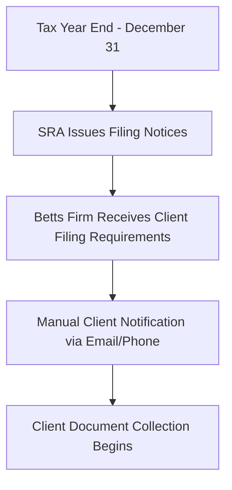
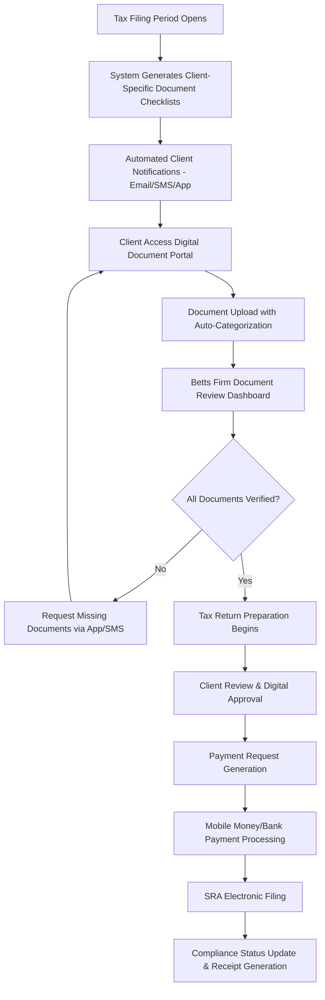

# Sierra Leone Tax Filing Process - Analysis & Optimization

**Document Version:** 1.0  
**Last Updated:** July 22, 2025  
**Scope:** Document collection and tax filing workflow for Sierra Leone clients  

## Current Tax Filing Process Analysis

### Sierra Leone Tax Environment

#### **Tax Authority:** Sierra Leone Revenue Authority (SRA)
#### **Tax Year:** January 1 - December 31
#### **Major Tax Types:**
- **Personal Income Tax** - Progressive rates (0%, 15%, 20%, 25%, 30%)
- **Corporate Income Tax** - Flat 25% rate
- **Goods and Services Tax (GST)** - 15% standard rate
- **Pay As You Earn (PAYE)** - Same as personal income tax rates
- **Excise Duty** - Specific rates per product category
- **Withholding Tax** - 15% (increased from 10% in Finance Act 2024)

#### **Taxpayer Categories:**
- **Large Taxpayers** - Annual turnover > SLE 2 billion
- **Medium Taxpayers** - Annual turnover SLE 500 million - 2 billion  
- **Small Taxpayers** - Annual turnover SLE 50 million - 500 million
- **Micro Taxpayers** - Annual turnover < SLE 50 million

---

## Current Document Collection Workflow

### **Phase 1: Tax Period Initiation**


### **Phase 2: Document Gathering Process**

#### **Current Process Issues:**
1. **Manual Communication** - Phone calls and emails for document requests
2. **No Standardized Checklists** - Different associates request different documents
3. **Lost Documents** - No tracking system for submitted documents
4. **Multiple Submissions** - Clients submit same documents multiple times
5. **Incomplete Submissions** - No verification workflow

#### **Document Requirements by Tax Type:**

##### **Personal Income Tax Returns**
**Current Collection:** ❌ **Manual, Inconsistent**
- [ ] Employment income statements (P60/Payslips)
- [ ] Business income records (if self-employed)
- [ ] Investment income statements
- [ ] Rental income documentation
- [ ] Bank statements (12 months)
- [ ] Previous year tax clearance certificate
- [ ] National identification documents

##### **Corporate Income Tax Returns**  
**Current Collection:** ❌ **Manual, Inconsistent**
- [ ] Audited financial statements
- [ ] General ledger and trial balance
- [ ] Directors' remuneration schedule
- [ ] Depreciation schedules
- [ ] VAT returns (if registered)
- [ ] PAYE records for employees
- [ ] Corporate registration certificate
- [ ] Tax clearance certificate (previous year)

##### **GST Returns (Quarterly)**
**Current Collection:** ❌ **Manual, Inconsistent**
- [ ] Sales invoices and records
- [ ] Purchase invoices and receipts
- [ ] Import documentation
- [ ] Export documentation
- [ ] Credit and debit notes
- [ ] Bank reconciliation statements
- [ ] GST registration certificate

##### **PAYE Returns (Monthly)**
**Current Collection:** ❌ **Manual, Inconsistent**
- [ ] Employee payroll records
- [ ] NASSIT contributions schedule
- [ ] Staff loan/advance schedules
- [ ] New employee contracts
- [ ] Terminated employee documentation
- [ ] Overtime and bonus calculations

---

## Gap Analysis: Current vs Required Process

### **Critical Process Gaps**

| Process Area | Current State | Required State | Impact | Priority |
|--------------|---------------|----------------|---------|----------|
| **Document Checklist** | Manual, inconsistent | Automated, tax-type specific | High | Critical |
| **Document Tracking** | Email/phone follow-up | Real-time status dashboard | High | Critical |
| **Client Communication** | Multiple channels | Integrated messaging system | Medium | High |
| **Document Verification** | Manual review | Structured verification workflow | High | Critical |
| **Deadline Management** | Manual calendar | Automated alerts and reminders | High | High |
| **Progress Monitoring** | Phone calls/emails | Real-time compliance dashboard | Medium | High |

### **Quantified Impact of Current Gaps**
- **Average document collection time:** 45 days (industry standard: 21 days)
- **Missing document follow-ups:** 3-5 per client per filing period
- **Document resubmission rate:** 40% due to lost/misplaced files
- **Late filing penalty incidents:** 15% of clients (SRA penalty: 5% of tax due)
- **Associate time on document management:** 60% of total client interaction time

---

## Optimized Sierra Leone Tax Filing Process

### **Streamlined Digital Workflow**



### **Enhanced Document Collection System**

#### **1. Automated Document Checklists**
```typescript
interface TaxTypeDocumentRequirements {
  taxType: 'PersonalIncome' | 'Corporate' | 'GST' | 'PAYE' | 'ExciseDuty';
  taxpayerCategory: 'Large' | 'Medium' | 'Small' | 'Micro';
  requiredDocuments: DocumentRequirement[];
  optionalDocuments: DocumentRequirement[];
  deadlines: FilingDeadline[];
}

interface DocumentRequirement {
  id: string;
  name: string;
  description: string;
  isRequired: boolean;
  acceptedFormats: string[];
  maxFileSize: number;
  validationRules: ValidationRule[];
}
```

#### **2. Document Status Tracking**
- **Not Requested** - Not yet required
- **Requested** - Client notified, awaiting submission  
- **Submitted** - Client uploaded, pending review
- **Under Review** - Betts Firm reviewing document
- **Rejected** - Document issues, resubmission required
- **Verified** - Approved and ready for filing
- **Filed** - Included in tax return submission

#### **3. Smart Document Collection Features**

##### **Auto-Categorization**
- OCR scanning for document type detection
- Automatic filing in correct tax year/category
- Duplicate document detection and alerts

##### **Document Validation**
- File format verification (PDF, JPEG, PNG, DOC)
- File size limits (10MB max per document)
- Completeness checks (all pages present)
- Data extraction and validation

##### **Progress Tracking**
- Visual progress indicators per tax type
- Completion percentage calculations  
- Missing document alerts with priority levels
- Estimated completion time based on submission pace

---

## Sierra Leone Mobile Money Payment Integration

### **Payment Provider Integration Architecture**

#### **Orange Money Sierra Leone**
```typescript
interface OrangeMoneyPayment {
  merchantId: string;
  apiKey: string;
  paymentAmount: number;
  currency: 'SLE';
  clientMobile: string;
  taxFilingReference: string;
  transactionCallback: string;
}
```

#### **Africell Money Sierra Leone**
```typescript
interface AfricellMoneyPayment {
  merchantAccount: string;
  secretKey: string;
  amount: number;
  currency: 'SLE';
  customerPhone: string;
  orderId: string;
  notificationUrl: string;
}
```

#### **Local Banking Integration**
- **Sierra Leone Commercial Bank** - API Gateway integration
- **Rokel Commercial Bank** - Payment gateway integration
- **Standard Chartered Sierra Leone** - Corporate banking API
- **Guaranty Trust Bank Sierra Leone** - Mobile banking integration

#### **International Payment Support**
- **PayPal** - For Sierra Leone diaspora clients
- **Stripe** - Multi-currency support
- **Wise (TransferWise)** - Low-cost international transfers
- **Remitly** - Diaspora remittance integration

---

## Compliance Dashboard Enhancement

### **Real-Time Compliance Monitoring**

#### **Client Compliance Score Calculation**
```typescript
interface ComplianceScore {
  clientId: string;
  overallScore: number; // 0-100
  components: {
    documentSubmission: number; // 0-25
    timelyFiling: number;      // 0-25  
    paymentCompliance: number; // 0-25
    accuracyScore: number;     // 0-25
  };
  riskLevel: 'Low' | 'Medium' | 'High' | 'Critical';
  actionRequired: ComplianceAction[];
}
```

#### **Automated Alerts & Reminders**

##### **Document Collection Alerts**
- **Initial Request:** 60 days before filing deadline
- **First Reminder:** 45 days before deadline  
- **Second Reminder:** 30 days before deadline
- **Urgent Alert:** 15 days before deadline
- **Critical Alert:** 7 days before deadline

##### **Payment Alerts**
- **Payment Due:** 30 days before payment deadline
- **Payment Reminder:** 15 days before deadline
- **Final Notice:** 5 days before deadline
- **Overdue Alert:** Day after deadline

##### **Communication Channels**
- **SMS:** For urgent alerts and payment confirmations
- **WhatsApp Business:** For document requests and status updates  
- **Email:** For detailed reports and formal communications
- **In-App Push:** For real-time notifications
- **USSD Codes:** For basic status queries via mobile network

---

## Implementation Recommendations

### **Phase 1: Core Document Management (4 weeks)**

#### **Backend Implementation**
1. **Document Requirements Engine**
   ```csharp
   public class DocumentRequirementService
   {
       Task<List<DocumentRequirement>> GetRequiredDocuments(
           TaxType taxType, 
           TaxpayerCategory category, 
           int taxYear);
       
       Task<DocumentStatus> ValidateDocument(
           IFormFile document, 
           DocumentRequirement requirement);
       
       Task<ComplianceScore> CalculateComplianceScore(string clientId);
   }
   ```

2. **Document Verification Workflow**
   ```csharp
   public class DocumentReviewService
   {
       Task<ReviewResult> SubmitForReview(int documentId, string associateId);
       Task<ReviewResult> ApproveDocument(int documentId, string reviewerId);
       Task<ReviewResult> RejectDocument(int documentId, string reason);
       Task<List<PendingReview>> GetPendingReviews(string associateId);
   }
   ```

#### **Frontend Implementation**
1. **Document Upload Interface**
   - Drag-and-drop file upload
   - Progress indicators
   - Document preview
   - Status tracking

2. **Associate Review Dashboard**
   - Pending document queue
   - Document viewer
   - Approval/rejection workflow
   - Client communication tools

### **Phase 2: Payment Integration (6 weeks)**

#### **Orange Money Integration**
```csharp
public class OrangeMoneyService : IPaymentProvider
{
    public async Task<PaymentResult> InitiatePayment(PaymentRequest request)
    {
        // Orange Money API integration
        var response = await _httpClient.PostAsync(
            "https://api.orange.sl/v1/payments/mobile", 
            CreatePaymentRequest(request));
        
        return ProcessPaymentResponse(response);
    }
}
```

#### **Payment Flow Implementation**
1. **Payment Request Creation**
2. **Client Mobile Number Verification**
3. **Mobile Money PIN Prompt**
4. **Payment Confirmation**
5. **Receipt Generation and Storage**
6. **Tax Filing Payment Link**

### **Phase 3: Advanced Features (8 weeks)**

#### **OCR Document Processing**
- Integration with Azure Cognitive Services or AWS Textract
- Automatic data extraction from common tax forms
- Data validation against client records
- Error detection and flagging

#### **Electronic SRA Filing**
- SRA API integration (when available)
- XML format generation for tax returns
- Electronic submission confirmation
- Filing status tracking

#### **Advanced Analytics**
- Client performance dashboards
- Filing trend analysis
- Revenue projections
- Compliance risk assessment

---

## Expected Outcomes

### **Efficiency Improvements**
- **Document collection time:** Reduce from 45 days to 21 days (53% improvement)
- **Follow-up communications:** Reduce from 3-5 to 1-2 per client (60% improvement)  
- **Document resubmission:** Reduce from 40% to 10% (75% improvement)
- **Late filing penalties:** Reduce from 15% to 5% of clients (67% improvement)

### **Client Experience Enhancement**
- **24/7 document submission** capability
- **Real-time status updates** via multiple channels
- **Automated reminders** preventing missed deadlines
- **Integrated payment processing** with instant confirmation
- **Historical document access** for client records

### **Associate Productivity**
- **60% reduction** in document management time
- **Automated document validation** and categorization
- **Centralized review dashboard** for efficient processing
- **Automated compliance reporting** and risk assessment

---

## Risk Mitigation

### **Technical Risks**
- **API Reliability:** Implement retry mechanisms and fallback options
- **Data Security:** End-to-end encryption and secure file storage
- **System Downtime:** Load balancing and redundant infrastructure
- **Document Loss:** Automated backups and version control

### **Business Risks**  
- **Client Adoption:** Phased rollout with training and support
- **Regulatory Changes:** Flexible system architecture for quick updates
- **Competition:** Continuous feature enhancement based on client feedback
- **Staff Training:** Comprehensive training program for associates

---

## Conclusion

The optimized Sierra Leone tax filing process addresses critical gaps in the current system while leveraging local payment methods and communication preferences. The proposed digital workflow will significantly improve efficiency, compliance, and client satisfaction while positioning The Betts Firm as a technology leader in Sierra Leone's tax consulting sector.

**Key Success Factors:**
1. **Mobile-first approach** for Sierra Leone's mobile-centric population
2. **Local payment integration** with Orange Money and Africell Money
3. **Multi-language support** (English and Krio) for broader accessibility
4. **Offline capability** for areas with limited internet connectivity
5. **Compliance automation** to prevent penalties and ensure deadlines

The implementation roadmap provides a clear path to achieving these improvements while maintaining system security and regulatory compliance.